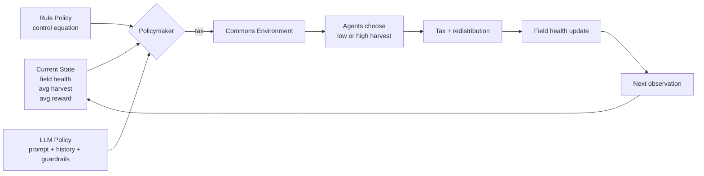
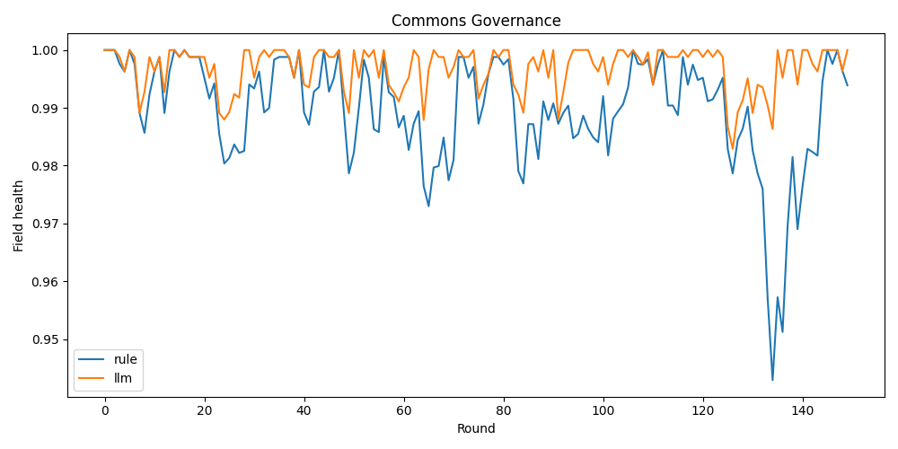
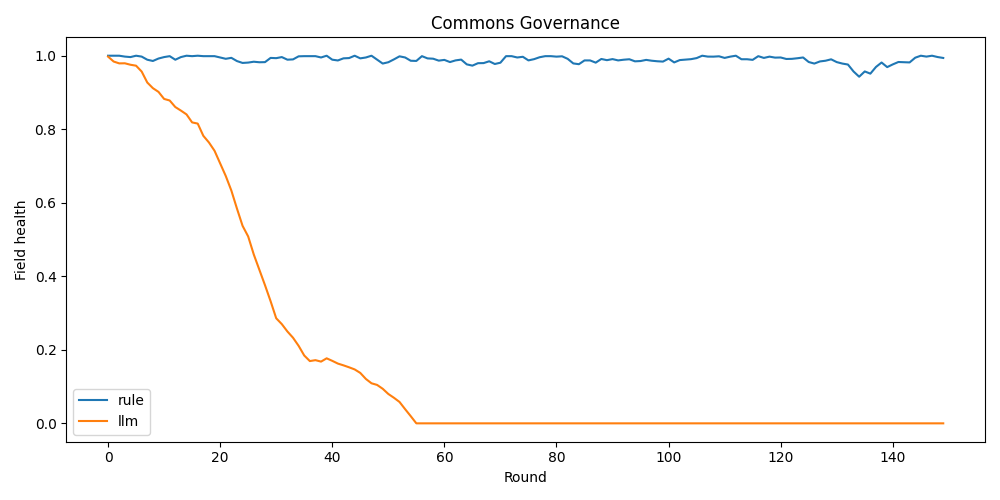
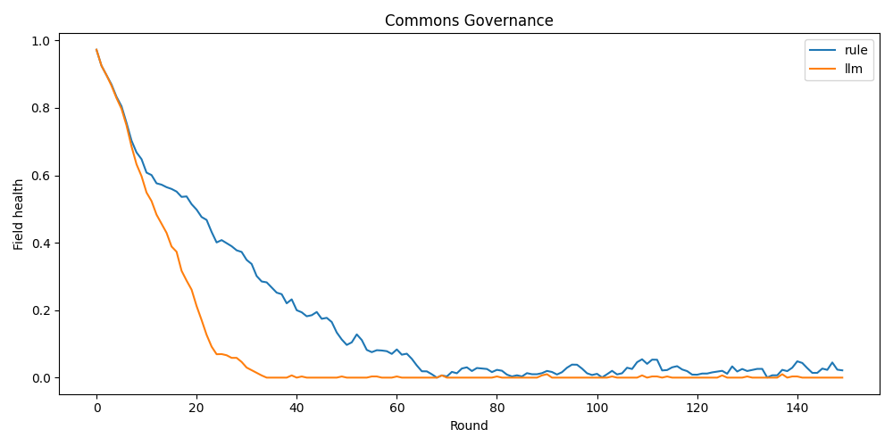
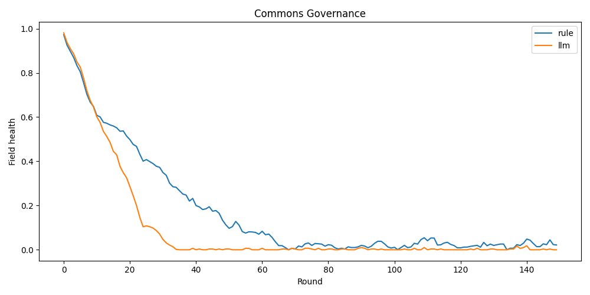

# ai-commons-governance

A simplified commons-governance simulation comparing a control-based rule policy and an LLM-based policy.

## Overview

We simulate 10 self-interested agents harvesting from a shared field. A policymaker sets a tax each round to regulate harvesting indirectly through incentives. The goal is to maintain high field health over time.

## Current Architecture

## Core Equations

Environment:

`reward = harvest * (1 - tax) + redistribution`

`redistribution = total_tax / n_agents`

If `H < 0.3`:

`penalty = 0.5 + 0.5 * H`

`reward = reward * penalty`

`avg_harvest = mean(harvests)`

`delta_H = a * (1 - avg_harvest) * H - b * avg_harvest`

`H(t+1) = clip(H(t) + delta_H, 0, 1)`

Agent decision:

`P(high) = exp(s_high / T) / (exp(s_high / T) + exp(s_low / T))`

Rule policy:

`tax = base + k1 * (H_target - H) + k2 * (avg_harvest - h_target) - k3 * (avg_reward - r_target)`

## Final Setup Used

Environment parameters:

- `a = 0.2`
- `b = 0.2`
- collapse threshold = `0.3`

Agent parameters:

- `LOW = 0.2`
- `HIGH = 0.65`
- greed factor in high-harvest score = `0.3`
- softmax temperature `T = 0.6`
- `p_high` cap = `0.8`

Rule-policy parameters:

- `base = 0.7`
- `k1 = 2.5`
- `k2 = 1.2`
- `k3 = 0.2`
- `H_target = 0.7`
- `h_target = 0.5`
- `r_target = 0.5`

LLM policy:

- current state: field health, average harvest, average reward
- trend: change in health
- last 5 rounds of history
- output smoothing and safety floors after raw LLM output

## Result 4: Final Comparison Under Stabilized Dynamics

Under the final stabilized setup, both policymakers maintain high field health over 150 rounds and 5 seeds. The LLM-based policy slightly outperforms the control-based rule policy on the final-50-round metric.

Final 50-round field health:

- `rule = [0.9774621218042437, 0.989423095357876, 0.9955594184800001, 0.9879524891710304, 0.9831281726434398]`
- `llm  = [0.9965356991644037, 0.9953180542168001, 0.9990399999999999, 0.9990399999999999, 0.9949543702143999]`

Aggregate results:

- `rule mean = 0.9867`
- `llm mean = 0.9970`
- `total llm api cost = 0.032493 USD`

This final result shows that once the environment is stabilizable and the agent response is softened, the LLM can become competitive and slightly outperform the control baseline.

## Experiments

### Result 3: Stabilized Control Policy with Softer Agent Response

After refining the environment, softening agent aggressiveness, and replacing the threshold baseline with a continuous controller, the system became stabilizable. In the sanity check, field health remained high instead of collapsing, showing that stability depends on co-design of environment dynamics, policy, and agent sensitivity.

### Result 2: Passing Structured Reasoning Signals

Adding structured reasoning signals to the prompt improved the LLM’s context, but it still did not produce stable long-term control in the earlier unstable setting. The LLM remained reactive rather than preventive.

### Result 1: Original Unstable Setting

In the original setup, field health declined for both policies and the LLM collapsed faster. The environment used stronger effective damage, weaker recovery, and harsher collapse behavior, so neither policy maintained long-term sustainability.

## Key Takeaways

- Environment design determines whether stabilization is possible.
- Agent behavior and policy must be co-designed.
- Rule-based control gives a strong, interpretable baseline.
- LLMs improve significantly when given structure, smoothing, and guardrails.
